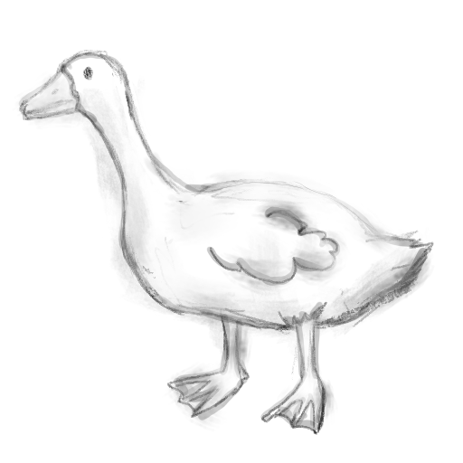

<div align="center">
  
  <h1>Goose</h1>
  <p><strong>A pure Zig D-Bus implementation.</strong></p>
</div>

Goose is a library written in Zig that provides a native implementation of the D-Bus protocol. It allows you to connect to the D-Bus system or session bus, send and receive messages, handle signals, and introspect D-Bus objects.

## Features

- **Pure Zig:** No C dependencies.
- **Bus Connection:** Support for Session, System, and Accessibility buses.
- **Method Calls:** Call methods on remote objects easily using Proxies.
- **Signals:** Subscribe to and handle D-Bus signals.
- **Object Export:** Export local Zig objects to the bus with minimal boilerplate.
- **Introspection:** Parse and generate D-Bus introspection XML.
- **Code Generation:** Includes a tool to generate Zig proxy code from introspection XML.

## Architecture

Goose is designed to be a lightweight, pure-Zig alternative to `libdbus` or `GDBus`.
It handles the entire D-Bus stack, from socket communication to type marshaling.

### Bus Connection

The `Connection` struct manages the Unix Domain Socket and implements the SASL[^1] `EXTERNAL`
authentication handshake. It buffers stream data and runs a blocking message loop
that routes incoming signals and method replies to the appropriate handlers.

### Type System

Goose uses compile-time reflection to map Zig types to D-Bus signatures.
Integers, structs, strings, and variants are automatically marshaled into the
D-Bus wire format with correct alignment and endianness. Wrappers like
`GStr` and `GPath` ensure strict type safety for D-Bus specific concepts.

### Method Dispatcher

Standard Zig structs can be exported as D-Bus objects. The library analyzes public
methods and fields to set up automatic routing for method calls. It also generates
introspection XML and exposes `Property` fields via the standard
`org.freedesktop.DBus.Properties` interface.

### Client Proxies

The `Proxy` abstraction simplifies client-side interactions by handling the
construction of method call messages and parsing of replies, hiding the
low-level details of the protocol.

## Installation

You can add `goose` to your project using `zig fetch`:

```bash
zig fetch --save git+https://github.com/luxluth/goose.git#master
```

## Usage

More examples of client and server usage can be found in the `src/tests/` directory.

### Connecting to the Bus

```zig
const std = @import("std");
const goose = @import("goose");

pub fn main() !void {
    var gpa = std.heap.GeneralPurposeAllocator(.{}){};
    defer _ = gpa.deinit();
    const allocator = gpa.allocator();

    // Connect to the session bus
    var conn = try goose.Connection.init(allocator, .Session);
    defer conn.close();

    // ... use the connection
}
```

### Calling a Method

You can use the `Proxy` to interact with remote objects.

```zig
const proxy = goose.proxy;
const GStr = goose.core.value.GStr;

// Initialize a proxy for a specific object and interface
const p = proxy.Proxy.init(&conn, "org.freedesktop.DBus", "/org/freedesktop/DBus", "org.freedesktop.DBus");

// Call a method (e.g., ListNames)
var result = try p.call("ListNames", .{});
defer result.deinit();

// Parse the result
// (Note: Implementation details for parsing specific complex return types may vary)
```

### Handling Signals

Register a callback function to handle specific signals.

```zig
fn onSignal(_: ?*anyopaque, msg: goose.core.Message) void {
    std.debug.print("Received signal!\n", .{});
}

// ... inside main
try conn.addMatch("type='signal',interface='dev.myinterface.test'");
try conn.registerSignalHandler("dev.myinterface.test", "MySignal", onSignal, null);
```

### Exporting an Object

Define a struct to represent your D-Bus interface and register it on the connection.

```zig
const std = @import("std");
const goose = @import("goose");

// Define the Interface
const MyInterface = struct {
    conn: *goose.Connection,

    // Properties (exposed via org.freedesktop.DBus.Properties)
    Count: goose.Property(i32, .ReadWrite) = goose.property(i32, .ReadWrite, 0),

    // Signals
    Tick: goose.Signal(i32) = goose.signal("Tick", i32),

    pub fn init(conn: *goose.Connection, _: void) @This() {
        return .{ .conn = conn };
    }

    // Methods are automatically exported
    pub fn Increment(self: *MyInterface) !i32 {
        self.Count.value += 1;
        // Trigger signal
        try self.Tick.trigger(self.conn, self.Count.value);
        return self.Count.value;
    }
};

pub fn main() !void {
    var gpa = std.heap.GeneralPurposeAllocator(.{}){};
    defer _ = gpa.deinit();
    const allocator = gpa.allocator();

    var conn = try goose.Connection.init(allocator, .Session);
    defer conn.close();

    // Register Object: (Interface Type, Bus Name, Object Path)
    const handle = try conn.registerObject(
        MyInterface,
        "com.example.MyService",
        "/com/example/MyObject"
    );

    // Serve requests
    try conn.waitOnHandle(handle);
}
```

## Tools

Goose includes helper tools for introspection and code generation.
To use these tools in your own project, you must explicitly install them as
artifacts in your `build.zig`:

```zig
const goose_dep = b.dependency("goose", .{
    .target = target,
    .optimize = optimize,
});

b.installArtifact(goose_dep.artifact("goose-introspection"));
b.installArtifact(goose_dep.artifact("goose-generate"));
```

### Introspector

A tool to introspect a D-Bus object and output its XML definition.

```bash
./zig-out/bin/goose-introspection <destination> <path> <bus_type>
```

### Proxy Generator

Generate type-safe Zig bindings from D-Bus introspection XML.

```bash
./zig-out/bin/goose-generate <destination> <path> <bus_type>
```

## License

This project is licensed under the MIT License - see the [LICENSE](LICENSE) file for details.

[^1]: SASL (Simple Authentication and Security Layer) is used here to implement the `EXTERNAL` mechanism, which leverages Unix domain socket credentials for authentication.
